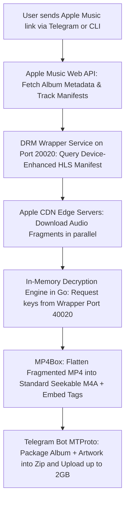

# 🎵 Apple Music Studio Lossless Downloader & Telegram Bot

A high-performance, native Windows/Linux tool and Telegram Bot to download, decrypt, tag, and package Apple Music tracks and albums in **Bit-Perfect 24-bit Studio Lossless ALAC (up to 192 kHz) / Dolby Atmos**.

---

## 📖 Table of Contents
- [Architecture: How It Works](#-architecture-how-it-works)
- [Key Features](#-key-features)
- [Prerequisites](#-prerequisites)
- [Quick Start Guide](#-quick-start-guide)
- [CLI (Command-Line) Usage](#-cli-command-line-usage)
- [Configuration (`config.yaml`)](#-configuration-configyaml)
- [Project Directory Structure](#-project-directory-structure)
- [Troubleshooting & Common Issues](#-troubleshooting--common-issues)
- [Deploying on a Linux VPS (Optional)](#-deploying-on-a-linux-vps-optional)

---

## 🏗️ Architecture: How It Works

Understanding the end-to-end pipeline:



1. **Manifest Retrieval**: The downloader queries Apple's Music API for track info, then requests the full un-truncated `.m3u8` master manifest from the DRM wrapper service (port `20020`).
2. **Chunked Stream Download**: Download engine fetches raw HLS byte-ranges directly from Apple's fast worldwide CDN servers.
3. **Multi-Worker In-Memory Decryption**: 10 concurrent Go worker routines decrypt the FairPlay/Widevine-protected AES samples in RAM.
4. **Container Flattening (MP4Box)**: Uses bundled `mp4box.exe` to unify fragmented MP4 (`fmp4`) streams into a clean, seekable single-`moov` M4A container with embedded synchronized `.lrc` lyrics and high-resolution cover art (up to 5000x5000).
5. **Direct Delivery**: The Python MTProto engine bundles the album into a single archive and delivers it via Telegram (supporting up to 2,000 MB per file).

---

## ✨ Key Features

- **🔍 Direct In-Telegram Search (`/search <query>`)**: Search Apple Music's entire catalog directly inside your chat and pick songs with interactive buttons.
- **🎛️ Interactive Format Selector Buttons**: Pick between **24-bit Lossless ALAC**, **Dolby Atmos (Spatial Audio)**, or **Full Album (.zip)** with one tap.
- **Zero Docker Requirement**: Runs natively on Windows using Go, Python, and MP4Box. Docker Desktop is completely eliminated.
- **True Studio Master Audio**: Downloads genuine 24-bit Lossless ALAC (up to 192,000 Hz) verified as bit-perfect with full 22.05 kHz+ acoustic frequency response.
- **2 GB Telegram Bot Uploads**: Uses Pyrogram/Telethon MTProto to bypass Telegram's standard 50 MB bot limit, supporting full multi-disc discographies in a single `.zip`.
- **Live Real-time Progress**: Streams live download speeds (10–25 MB/s), current track titles, decryption progress, and upload bars directly into Telegram.
- **Embedded Lyrics & Covers**: Automatically extracts and embeds timed `.lrc` lyrics and square album artwork (`cover.jpg`).

---

## 📦 Prerequisites

Ensure you have the following installed on your Windows machine:
1. **Python 3.8+** (with `pip` added to your system PATH)
2. **WSL2 (Windows Subsystem for Linux)**:
   * To enable WSL on Windows, open PowerShell as Administrator and run:
     ```powershell
     wsl --install
     ```
   * *(WSL is only used to run the small Linux DRM wrapper daemon in the background)*.
3. **Go (Optional)**: Only required if you want to modify and recompile `main.go` from source. Pre-compiled `am-dl.exe` is already included.

---

## 🚀 Quick Start Guide

### Step 1: Run Environment Setup
Double-click **`setup.bat`** (or execute in PowerShell):
```cmd
.\setup.bat
```
This will:
- Install required Python libraries (`pyrogram`, `tgcrypto`, `pyyaml`, etc.).
- Validate configuration files.

---

### Step 2: Launch the DRM Wrapper
Double-click **`start_wrapper.bat`**:
```cmd
.\start_wrapper.bat
```
* **Keep this terminal window open in the background** while downloading or running the bot.
* This starts the local background DRM daemon listening on `127.0.0.1:20020` and `127.0.0.1:40020`.

---

### Step 3: Start the Telegram Bot
Double-click **`start_bot.bat`**:
```cmd
.\start_bot.bat
```
* The bot will connect to Telegram and display `DRM Wrapper Status: ONLINE`.
* Open Telegram, send any Apple Music **Album**, **Track**, or **Playlist** link to your bot, and it will deliver the packaged `.zip` archive!

---

## 💻 CLI (Command-Line) Usage

You can also use the standalone Windows CLI `am-dl.exe` directly:

```powershell
# 1. Download a full album in 24-bit Lossless ALAC
.\am-dl.exe "https://music.apple.com/in/album/am/663097964"

# 2. Download a single song
.\am-dl.exe --song "https://music.apple.com/in/album/am/663097964?i=663098065"

# 3. Download in Dolby Atmos / Spatial Audio
.\am-dl.exe --atmos "https://music.apple.com/in/album/ALBUM_NAME/ALBUM_ID"

# 4. Interactive track selection
.\am-dl.exe --select "https://music.apple.com/in/album/ALBUM_NAME/ALBUM_ID"

# 5. Search by track title
.\am-dl.exe --search song "Coldplay Yellow"
```

---

## ⚙️ Configuration (`config.yaml`)

Key options inside `config.yaml`:

| Key | Value | Purpose |
| :--- | :--- | :--- |
| `get-m3u8-mode` | `all` | Ensures all songs (Lossless, AAC, Hi-Res) fetch full-duration manifests from wrapper. |
| `template-decrypt` | `true` | Enables high-speed multi-threaded in-memory AES decryption. |
| `key-server` | `127.0.0.1:40020` | Local DRM wrapper decryption port. |
| `get-m3u8-port` | `127.0.0.1:20020` | Local DRM wrapper manifest port. |
| `alac-max` | `192000` | Maximum sample rate limit (192000, 96000, 48000, 44100). |
| `storefront` | `"in"` | Storefront country code (`in`, `us`, `gb`, `jp`, etc.). |
| `embed-cover` | `true` | Embeds album artwork into downloaded files. |
| `embed-lrc` | `true` | Embeds synchronized lyrics. |
| `telegram-api-id` | `36379870` | Telegram MTProto Client API ID. |
| `telegram-api-hash` | `f9a516...` | Telegram MTProto Client API Hash. |
| `telegram-bot-token` | `882516...` | Telegram Bot API Token from `@BotFather`. |

---

## 📁 Project Directory Structure

```
d:\Apple_music\
├── bin\                        # Bundled tools & runtime DLLs (isolated from root)
│   ├── mp4box.exe              # GPAC MP4Box (flattens fmp4 into seekable M4A)
│   ├── ffmpeg.exe              # Windows FFmpeg utility binary
│   ├── gpac.exe                # GPAC CLI
│   └── *.dll                   # Runtime libraries (libgpac.dll, avcodec-60.dll, etc.)
├── AM-DL downloads\            # Output directory for downloaded lossless music
│   ├── Archives\               # Packaged album zip files
│   └── <Year> - <Album>\       # Downloaded songs & cover art
├── utils\                      # Go audio decoders, metadata, and task managers
│   ├── runv4\                  # Multi-threaded HLS fragment stream decryptor
│   ├── ampapi\                 # Apple Music Storefront API client
│   └── task\                   # Album, playlist, and track queue handlers
├── am-dl.exe                   # Native Windows downloader executable
├── bot.py                      # 2GB Telegram Bot with MTProto upload engine
├── config.yaml                 # Active configuration file
├── config.yaml.example         # Configuration template
├── setup.bat                   # 1-Click setup script
├── start_wrapper.bat           # 1-Click DRM wrapper launcher (via WSL)
├── start_bot.bat               # 1-Click Telegram Bot launcher (auto-adds bin\ to PATH)
├── main.go                     # Downloader Go source code
└── README.md                   # Project documentation
```

---

## 🔧 Troubleshooting & Common Issues

### 1. Song is cut off at ~15 seconds?
* **Cause**: In older setups, missing `MP4Box.exe` caused `ffmpeg -c copy` to run on fragmented MP4 files, which truncates the stream after the first fragment.
* **Fix**: Ensure `mp4box.exe` is present in the project folder (bundled by default) and `get-m3u8-mode: all` is set in `config.yaml`.

### 2. "Connection refused on port 20020 / 40020"
* **Cause**: The DRM wrapper service is not running.
* **Fix**: Run `start_wrapper.bat` in a separate window and ensure it initializes before starting downloads.

### 3. Bitrate shows 1600–1800 kbps instead of 2116 kbps?
* **Explanation**: This is completely normal! ALAC is a variable-bitrate lossless compression format. `2116 kbps` is the uncompressed theoretical bitrate of 24-bit/44.1kHz audio. When compressed with ALAC, the file size is reduced without losing any audio quality.

### 4. Freeing RAM after downloading
* When you are done for the day and want to release WSL's memory pool (`VmmemWSL`), run:
  ```powershell
  wsl --shutdown
  ```

---

## 🐧 Deploying on a Linux VPS (Optional)

If you want to run this bot **24/7 in the cloud** on a cheap $3–$5/month Linux VPS (Ubuntu/Debian):
1. **No WSL or Docker needed**: Everything runs natively with under 150 MB of RAM usage.
2. Install system tools:
   ```bash
   sudo apt update && sudo apt install -y gpac ffmpeg python3 python3-pip
   ```
3. Install Python requirements:
   ```bash
   pip3 install -r requirements.txt
   ```
4. Run the wrapper and bot in background `tmux` sessions or as `systemd` services:
   ```bash
   # Terminal 1: Run wrapper
   cd ~/wrapper && ./wrapper

   # Terminal 2: Run bot
   python3 bot.py
   ```
