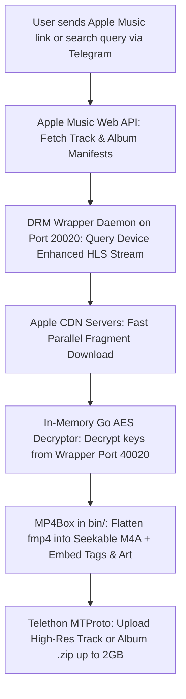

# 🎵 Apple Music Studio Lossless Downloader & Telegram Bot

A high-performance, native Windows/Linux tool and Telegram Bot to download, decrypt, tag, and package Apple Music tracks and albums in **Bit-Perfect 24-bit Studio Lossless ALAC (up to 192 kHz) / Dolby Atmos**.

---

## 📖 Table of Contents
- [Architecture: How It Works](#-architecture-how-it-works)
- [Key Features](#-key-features)
- [Prerequisites](#-prerequisites)
- [🤖 Telegram Bot Setup Guide](#-telegram-bot-setup-guide)
- [🍎 Apple Music & DRM Wrapper Setup Guide](#-apple-music--drm-wrapper-setup-guide)
- [🚀 Quick Start (1-Click Launchers)](#-quick-start-1-click-launchers)
- [💬 Bot Usage & Commands](#-bot-usage--commands)
- [💻 CLI (Command-Line) Usage](#-cli-command-line-usage)
- [⚙️ Configuration Reference (`config.yaml`)](#-configuration-reference-configyaml)
- [📁 Project Directory Structure](#-project-directory-structure)
- [🔧 Troubleshooting & Common Issues](#-troubleshooting--common-issues)
- [🐧 Deploying on a Linux VPS (Optional)](#-deploying-on-a-linux-vps-optional)

---

## 🏗️ Architecture: How It Works

Understanding the end-to-end pipeline:



1. **Manifest Retrieval**: Queries Apple Music API for metadata, then requests the full un-truncated `.m3u8` master manifest from the local DRM wrapper daemon (port `20020`).
2. **Chunked Stream Download**: Download engine fetches raw HLS byte-ranges directly from Apple's worldwide CDN servers.
3. **Multi-Worker In-Memory Decryption**: 10 concurrent Go worker routines decrypt the FairPlay/Widevine-protected AES samples in RAM.
4. **Container Flattening (MP4Box)**: Uses bundled `bin/mp4box.exe` to unify fragmented MP4 (`fmp4`) streams into clean, seekable single-`moov` M4A containers with embedded synchronized `.lrc` lyrics and high-resolution cover art (up to 5000x5000).
5. **Direct Telegram Delivery**: The Python MTProto engine delivers tracks or packages albums into a `.zip` archive delivered directly in chat (supporting up to 2,000 MB per file).

---

## ✨ Key Features

- **🔍 In-Telegram Search (`/search <query>`)**: Search Apple Music's entire catalog directly inside your chat and switch between song and album search views with interactive buttons.
- **🎛️ Interactive Format Selection**: Pick between **24-bit Lossless ALAC**, **Dolby Atmos (Spatial Audio)**, or **Full Album (.zip)** with one tap.
- **Zero Docker Requirement**: Runs natively on Windows using Go, Python, and MP4Box. Docker Desktop is completely eliminated.
- **True Studio Master Audio**: Downloads genuine 24-bit Lossless ALAC (up to 192,000 Hz) verified as bit-perfect with full acoustic frequency response.
- **2 GB Telegram Bot Uploads**: Uses Telethon MTProto to bypass Telegram's standard 50 MB bot limit, supporting full multi-disc discographies in a single `.zip`.
- **Live Real-time Progress**: Streams download speeds, current track titles, decryption progress, and upload bars directly into Telegram.
- **Embedded Lyrics & Covers**: Automatically extracts and embeds timed `.lrc` lyrics and square album artwork (`cover.jpg`).

---

## 📦 Prerequisites

Ensure you have the following installed on your Windows machine:
1. **Python 3.10+**: Download from [python.org](https://www.python.org/) (ensure **"Add Python to PATH"** is checked during installation).
2. **WSL2 (Windows Subsystem for Linux)**:
   * To enable WSL on Windows, open PowerShell as Administrator and run:
     ```powershell
     wsl --install
     ```
   * Restart your PC if prompted. *(WSL is used solely to host the lightweight local DRM wrapper daemon).*
3. **Go 1.23+ (Optional)**: Only needed if you wish to modify Go source code. The compiled executable `am-dl.exe` is already pre-built and included.

---

## 🤖 Telegram Bot Setup Guide

To run your own private Telegram bot with **2,000 MB (2 GB) upload capabilities**, you need credentials from Telegram:

### Step 1: Create Your Bot with BotFather
1. Open Telegram and search for [@BotFather](https://t.me/BotFather).
2. Send `/newbot`.
3. Enter a display name for your bot (e.g., `My Apple Music Bot`).
4. Enter a unique username ending in `bot` (e.g., `MyAppleMusicDownload_bot`).
5. Copy the **HTTP API Bot Token** provided by BotFather (looks like `8825166911:AAGLDIMebm...`).

### Step 2: Get Telegram API ID & API Hash (Required for 2GB MTProto Uploads)
Standard Telegram bot tokens are restricted to sending files under 50 MB. To unlock **2,000 MB (2 GB)** direct uploads:
1. Log in to [my.telegram.org](https://my.telegram.org) using your Telegram phone number.
2. Click on **API Development Tools**.
3. Fill in the short form (App title and Short name can be anything, e.g., `MusicBot`).
4. Copy your **`api_id`** (numeric, e.g. `36379870`) and **`api_hash`** (string, e.g. `f9a516a50ef...`).

### Step 3: Configure `.env`
1. In the project folder, create a file named `.env` (or copy `.env.example` to `.env`):
   ```bash
   copy .env.example .env
   ```
2. Open `.env` and fill in your credentials:
   ```ini
   # Telegram Bot Credentials
   TG_API_ID=your_api_id_here
   TG_API_HASH=your_api_hash_here
   TG_BOT_TOKEN=your_bot_token_here

   # WSL DRM Wrapper Settings
   WRAPPER_HOST=127.0.0.1
   WRAPPER_PORT=20020
   WRAPPER_AUTO_START=true
   WRAPPER_WSL_DIR=~/wrapper
   ```

---

## 🍎 Apple Music & DRM Wrapper Setup Guide

### Step 1: Configure Storefront & Settings (`config.yaml`)
1. Create your active `config.yaml` by copying the template:
   ```bash
   copy config.yaml.example config.yaml
   ```
2. Open `config.yaml` and configure your settings:
   * **`storefront`**: Set this to your 2-letter country code (`us`, `in`, `gb`, `jp`, `ca`, etc.). Match this to your Apple Music subscription region.
   * **`get-m3u8-mode`**: Keep set to `all` so both Lossless and Hi-Res streams fetch full master manifests.
   * **`album-folder-format`**: Set to `"{ReleaseYear} - {AlbumName}"` for clean date-ordered folders.
   * **`artist-folder-format`**: Set to `""` if you prefer folders named directly by album.

### Step 2: Extract `media-user-token` (For Synchronized Lyrics)
> **Note:** The `media-user-token` cookie allows the downloader to fetch timed `.lrc` lyrics and AAC-LC streams.
1. Open [music.apple.com](https://music.apple.com) in your browser and sign in to your Apple Music account.
2. Press `F12` (or Right Click → **Inspect**) to open Developer Tools.
3. Switch to the **Application** tab (Chrome / Edge) or **Storage** tab (Firefox).
4. In the left sidebar, expand **Cookies** and click on `https://music.apple.com`.
5. Locate the cookie named **`media-user-token`**.
6. Double-click its value, copy it, and paste it into `config.yaml`:
   ```yaml
   media-user-token: "eyJh..."
   ```

### Step 3: Launch the DRM Wrapper Daemon
The DRM wrapper decrypts FairPlay/Widevine audio keys locally on your machine:
1. Double-click **`start_wrapper.bat`**.
2. On first run, it automatically creates `~/wrapper` inside your WSL environment and downloads the required DRM service.
3. It runs an **auto-restarting daemon loop** (`while true; do ./wrapper; sleep 2; done`). If an Apple Music multi-device conflict occurs, it automatically restarts in 2 seconds.
4. **Keep this terminal window running in the background** while downloading.

---

## 🚀 Quick Start (1-Click Launchers)

Once configured, using the bot is effortless:

1. **Install Dependencies (First Time Only)**:
   Double-click **`setup.bat`**:
   ```cmd
   .\setup.bat
   ```
   * Installs Telethon, PyYAML, and supporting libraries.
   * Verifies `bin/mp4box.exe` and `am-dl.exe`.

2. **Start Wrapper**:
   Double-click **`start_wrapper.bat`** and leave it minimized.

3. **Start Bot**:
   Double-click **`start_bot.bat`**:
   ```cmd
   .\start_bot.bat
   ```
   * Connects to Telegram over MTProto.
   * Confirms `✅ DRM Wrapper Status: ONLINE (Port 20020 Reachable)`.

---

## 💬 Bot Usage & Commands

Open Telegram and interact with your bot:

* **Send Any Link**: Paste any Apple Music song, album, or playlist URL:
  ```
  https://music.apple.com/us/album/a-rush-of-blood-to-the-head/1123076757
  ```
  * The bot responds with interactive format buttons: **💎 24-bit Lossless ALAC**, **🌌 Dolby Atmos**, or **📦 Download Full Album (.zip)**.
* **Search Catalog**:
  ```
  /search Coldplay Yellow
  /search album A Rush of Blood to the Head
  ```
  * Switch between songs and albums with one tap using the inline toggle buttons.
* **Large Files (≥ 2 GB)**:
  * If an album exceeds Telegram's 2,000 MB upload limit, the bot downloads 100% of the album locally and replies with the exact local folder path on your PC.

---

## 💻 CLI (Command-Line) Usage

You can also use the standalone Windows CLI `am-dl.exe` directly without Telegram:

```powershell
# 1. Download a full album in 24-bit Lossless ALAC
.\am-dl.exe "https://music.apple.com/us/album/a-rush-of-blood-to-the-head/1123076757"

# 2. Download a single song
.\am-dl.exe --song "https://music.apple.com/us/album/am/663097964?i=663098065"

# 3. Download in Dolby Atmos / Spatial Audio
.\am-dl.exe --atmos "https://music.apple.com/us/album/ALBUM_NAME/ALBUM_ID"

# 4. Search directly from terminal
.\am-dl.exe --search song "Coldplay Yellow"
.\am-dl.exe --search album "Coldplay"
```

---

## ⚙️ Configuration Reference (`config.yaml`)

Key options inside `config.yaml`:

| Key | Recommended | Description |
| :--- | :--- | :--- |
| `storefront` | `"us"` / `"in"` | Storefront country code matching your Apple Music region. |
| `get-m3u8-mode` | `all` | Retrieves full-duration master manifests for all audio streams. |
| `alac-max` | `192000` | Maximum sample rate limit (192000, 96000, 48000, 44100). |
| `album-folder-format` | `"{ReleaseYear} - {AlbumName}"` | Structure of downloaded album folders. |
| `artist-folder-format` | `""` | Empty string places album folders directly under `AM-DL downloads\`. |
| `embed-cover` | `true` | Embeds high-resolution cover art into track files. |
| `cover-size` | `5000x5000` | Resolution for downloaded and embedded album artwork. |
| `embed-lrc` | `true` | Embeds synchronized `.lrc` lyrics into M4A tags. |
| `template-decrypt` | `false` | In-memory key decryption pipeline. |
| `key-server` | `127.0.0.1:40020` | Local DRM wrapper decryption port. |
| `get-m3u8-port` | `127.0.0.1:20020` | Local DRM wrapper stream manifest port. |

---

## 📁 Project Directory Structure

```
d:\Apple_music\
├── bin\                        # Bundled tools & runtime DLLs (isolated from root)
│   ├── mp4box.exe              # GPAC MP4Box (flattens fmp4 into seekable M4A)
│   ├── ffmpeg.exe              # Windows FFmpeg utility binary
│   ├── gpac.exe                # GPAC CLI
│   └── *.dll                   # Runtime libraries (libgpac.dll, avcodec-60.dll, etc.)
├── AM-DL downloads\            # Output directory for downloaded lossless music
│   ├── Archives\               # Packaged album zip files
│   └── <Year> - <Album>\       # Downloaded songs & cover art
├── utils\                      # Go audio decoders, metadata, and task managers
│   ├── runv4\                  # Multi-threaded HLS fragment stream decryptor
│   ├── ampapi\                 # Apple Music Storefront API client
│   └── task\                   # Album, playlist, and track queue handlers
├── am-dl.exe                   # Native Windows downloader executable
├── bot.py                      # 2GB Telegram Bot with MTProto upload engine
├── config.yaml                 # Active configuration file
├── config.yaml.example         # Configuration template
├── setup.bat                   # 1-Click setup script
├── start_wrapper.bat           # 1-Click DRM wrapper launcher (via WSL)
├── start_bot.bat               # 1-Click Telegram Bot launcher (auto-adds bin\ to PATH)
├── main.go                     # Downloader Go source code
└── README.md                   # Project documentation
```

---

## 🔧 Troubleshooting & Common Issues

### 1. Song is cut off at ~15 seconds?
* **Cause**: In older setups, missing `MP4Box.exe` caused `ffmpeg -c copy` to run on fragmented MP4 files, which truncates the stream after the first fragment.
* **Fix**: Ensure `mp4box.exe` is present in the project folder (bundled by default) and `get-m3u8-mode: all` is set in `config.yaml`.

### 2. "Connection refused on port 20020 / 40020"
* **Cause**: The DRM wrapper service is not running.
* **Fix**: Run `start_wrapper.bat` in a separate window and ensure it initializes before starting downloads.

### 3. Bitrate shows 1600–1800 kbps instead of 2116 kbps?
* **Explanation**: This is completely normal! ALAC is a variable-bitrate lossless compression format. `2116 kbps` is the uncompressed theoretical bitrate of 24-bit/44.1kHz audio. When compressed with ALAC, the file size is reduced without losing any audio quality.

### 4. Freeing RAM after downloading
* When you are done for the day and want to release WSL's memory pool (`VmmemWSL`), run:
  ```powershell
  wsl --shutdown
  ```

---

## 🐧 Deploying on a Linux VPS (Optional)

If you want to run this bot **24/7 in the cloud** on a cheap $3–$5/month Linux VPS (Ubuntu/Debian):
1. **No WSL or Docker needed**: Everything runs natively with under 150 MB of RAM usage.
2. Install system tools:
   ```bash
   sudo apt update && sudo apt install -y gpac ffmpeg python3 python3-pip
   ```
3. Install Python requirements:
   ```bash
   pip3 install -r requirements.txt
   ```
4. Run the wrapper and bot in background `tmux` sessions or as `systemd` services:
   ```bash
   # Terminal 1: Run wrapper
   cd ~/wrapper && ./wrapper

   # Terminal 2: Run bot
   python3 bot.py
   ```
